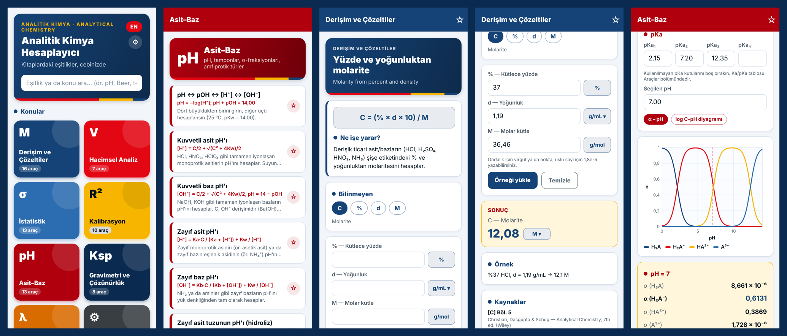
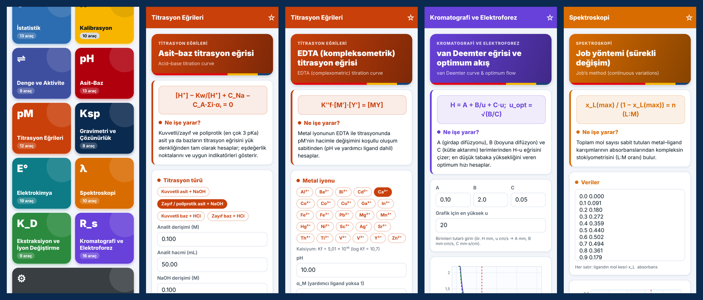
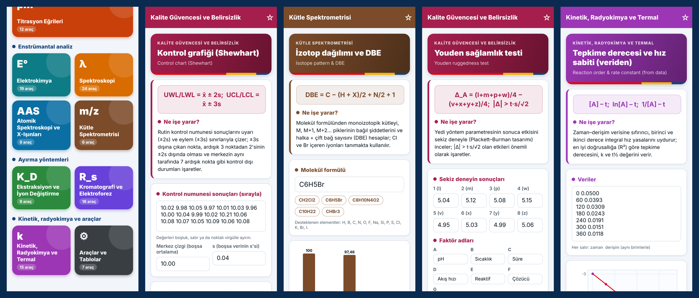

# Analitik Kimya Hesaplayıcı / Analytical Chemistry Calculator

Analitik kimya kitaplarındaki eşitlikleri konu bazlı, Türkçe/İngilizce hesaplayıcılara dönüştüren
React Native (Expo) mobil uygulaması. Arayüz kırmızı (#E30613), lacivert (#154377) ve sarı (#F7B500)
ağırlıklı bir renk paletiyle tasarlanmıştır.





## Kapsam (v3: 18 modül, 214 araç)

Ana sayfada modüller altı başlık altında gruplanır: temel hesaplar; veri, kalibrasyon ve kalite;
denge ve titrimetri; enstrümantal analiz; ayırma yöntemleri; kinetik, radyokimya ve araçlar.

### v1

| Modül | İçerik |
|---|---|
| Derişim ve Çözeltiler | mol, molarite, molalite, normalite, %, ppm/ppb, seyreltme, çözelti hazırlama, %+yoğunluk → M, titre |
| Hacimsel Analiz | titrasyon stokiyometrisi, % analit, ayarlama, geri titrasyon, titrasyon hatası, Kjeldahl |
| İstatistik | tanımlayıcı istatistik ve güven aralığı, t-testleri (3 tür), F-testi, Q-testi, Grubbs, ANOVA, belirsizlik yayılımı, normal dağılım, güç analizi |
| Kalibrasyon | doğrusal/ağırlıklı regresyon ve bilinmeyen tayini, tek ve çok noktalı standart ekleme, iç standart, LOD/LOQ, S/N, seçicilik, Sandell |
| Asit–Baz | pH dönüştürücü, kuvvetli/zayıf asit-baz, hidroliz, Henderson–Hasselbalch, tampon kapasitesi, amfiprotik türler, kan pH'ı, α-fraksiyonu ve log C–pH diyagramları |
| Gravimetri ve Çözünürlük | gravimetrik faktör, Ksp ↔ çözünürlük, ortak iyon, pH etkisi, bağıl aşırı doygunluk, kütle kaybı |
| Spektroskopi | λ–ν–ν̃–E dönüşümleri, %T ↔ A, Beer–Lambert, iki bileşenli karışım, fotometrik hata, floresans doğrusallığı |
| Araçlar ve Tablolar | molar kütle hesaplayıcı, Ka/pKa, Ksp, atom kütleleri, fiziksel sabitler, kritik t/F/Q/G değerleri |

### v2

| Modül | İçerik |
|---|---|
| Denge ve Aktivite | ΔG°–K, ΔG–Q, K birleştirme, aktivite, iyonik şiddet, Debye–Hückel (sınır/genişletilmiş), Davies, termodinamik K, yabancı iyon etkisi |
| Titrasyon Eğrileri | asit–baz (kuvvetli/zayıf/poliprotik), EDTA, çöktürme ve redoks eğrileri (tam denge çözümü), indikatör önerisi, türevle dönüm noktası, α_Y⁴⁻, koşullu Kf, su sertliği, Mohr, indikatör ve EDTA–Kf tabloları |
| Elektrokimya | ΔG = −nFE, E°–K, Nernst (pH'lı), hücre potansiyeli, referans dönüşümü, Ag/AgX elektrodu, cam elektrot, ISE (Nikolsky), potansiyometri hatası, Faraday/kulometri, Ilkovič, polarografik dalga, Randles–Ševčík, iletkenlik, Kohlrausch, E° tablosu |
| Ekstraksiyon ve İyon Değiştirme | K_D, pH'a bağlı D, % ekstraksiyon, ardışık ekstraksiyon, metal şelatları ve pH½, ayırma faktörü, iyon değiştirme D_g ve seçicilik, Craig dağılımı |
| Kromatografi ve Elektroforez | k, α, N (iki yöntem), H, R_s, Purnell, doğrusal hız, V_R, Kovats, Rf, GC net alıkonma hacmi, KE mobilitesi ve tabaka sayısı, van Deemter grafiği, pik rezolüsyonu görselleştirici |
| Spektroskopi (ek) | Job yöntemi (sürekli değişim) |

### v3

| Modül | İçerik |
|---|---|
| Kalite Güvencesi ve Belirsizlik | geri kazanım, bias/D%, geri kazanım düzeltmesi, Horwitz ve HorRat, B tipi belirsizlik, genişletilmiş belirsizlik, z/ζ/Eₙ skorları, σ_L; belirsizlik bütçesi, Shewhart kontrol grafiği (kural denetimli), Youden sağlamlık testi, 2ᵏ faktöriyel tasarım, tarama testi performansı |
| Örnekleme | örnekleme + analiz varyansı, Ingamells sabiti, binom tanecik örneklemesi, doğrulamada tekrar sayısı, iteratif numune sayısı |
| Atomik Spektroskopi ve X-Işınları | Boltzmann dağılımı, emisyon kalibrasyonu (I = kCⁿ), Duane–Hunt, Bragg, Moseley, X-ışını soğurması, XPS bağlanma enerjisi, Mössbauer geri tepme ve Doppler kayması |
| Kütle Spektrometrisi | çözünürlük, ppm kütle doğruluğu, manyetik sektör, TOF, ICR frekansı, izotop dağılımı ve DBE hesaplayıcısı |
| Kinetik, Radyokimya ve Termal | 1. ve 2. derece hız yasaları, t½, Michaelis–Menten, Arrhenius (tek/iki sıcaklık), radyoaktif bozunma, aktivite–madde miktarı, sayım istatistiği, izotop seyreltme, NAA (karşılaştırmalı ve oluşan aktivite), TGA kütle kaybı; veriden tepkime derecesi, Lineweaver–Burk |
| Spektroskopi (tamamlama) | IR (Hooke), ATR kritik açısı, Raman kayması, türbidimetri, molar refraksiyon, polarimetri, NMR kimyasal kayma ve Larmor frekansı, ESR, kırınım ağı, fiber NA, Stern–Volmer; çok bileşenli en küçük kareler, mol oranı/fotometrik titrasyon |

Formül tipindeki her araçta **herhangi bir değişken bilinmeyen seçilebilir**, birimler değiştirilebilir ve sonuç
yazdıkça hesaplanır. Her kartta kaynak kitap ve denklem numarası verilir (bkz. [docs/icerik-plani.md](docs/icerik-plani.md)).

## Çalıştırma

```bash
npm install
npx expo start        # QR kodu Expo Go ile okutun (Android/iOS)
npx expo start --web  # tarayıcıda
```

## Geliştirme

```bash
npm test              # Jest: kitap örnekleri, titrasyon eğrileri, QA/MS/kinetik motorları, kritik değerler
npm run typecheck     # TypeScript
npm run lint          # ESLint (eslint-config-expo)
```

### Klasör yapısı

```
src/
  app/            Expo Router ekranları (ana sayfa, modül, araç, ayarlar)
  components/     Ortak arayüz bileşenleri, formül hesaplayıcı, grafik, özel araçlar
  core/           Sayısal çözücü, birimler, istatistik, asit-baz, molar kütle, biçimlendirme
  data/formulas/  Modül başına eşitlik tanımları (TR/EN metin, değişkenler, kaynak, örnek)
  data/tables/    Ka, Ksp, atom kütleleri, fiziksel sabitler
  i18n/           Dil, anlamlı rakam ve favori ayarları
  theme/          Renk paleti
```

### Yeni eşitlik eklemek

`src/data/formulas/` altındaki ilgili dosyaya bir `formula({...})` kaydı ekleyin. `equation` alanı
(sol taraf − sağ taraf) yeterlidir: çözücü herhangi bir bilinmeyeni sayısal olarak bulur. Hız ve
kesinlik için `solve` ile kapalı çözümler de verilebilir. `examples` alanına kitaptan bir örnek
eklediğinizde test paketi eşitliği otomatik olarak doğrular (kapalı çözüm, sayısal çözüm ve tüm
değişkenler için geri dönüş testi).
